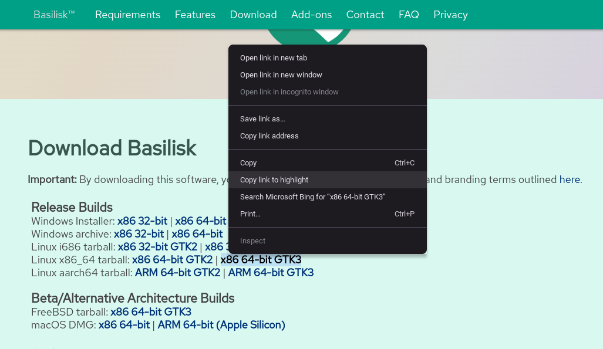
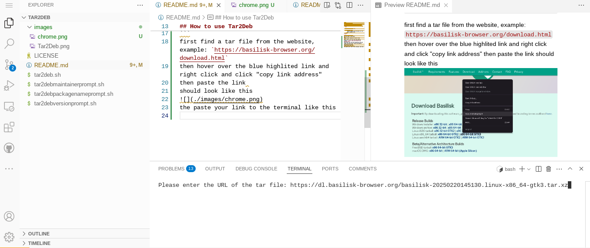

<br/>
<div align="center">
    
  </a>

  <h3 align="center"></h3>

  <p align="center">
       Convert almost any extracted tar file into a debian file.
    <br/>
</div>

## How to use Tar2Deb
when you get to this part
```
Please enter the URL of the tar file: 
```
first find a tar file from the website, example: `https://basilisk-browser.org/download.html`
then hover over the blue highlited link and right click and click "copy link address"
then paste the link 
should look like this

the paste your link to the terminal like this

then click enter
t